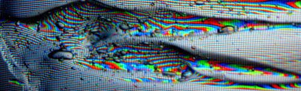

# INTRO TO DIGITAL VIDEO ART

#### .・゜:✧･ﾟ: *✧･ﾟ:* SJSU Art 75 | FALL 2018 *:･ﾟ✧*:･ﾟ✧
 

 #### ***[lectures](/lectures) - - - [readings](/readings) - - - [resources](/resources) - - - [tutorials](/tutorials)***

  ◇─◇──◇────◇────◇────◇────◇────◇─◇─◇
 

### *SCHEDULE*--->
### ***📆 [section1](/syllabi/section1) - - - 📅 [section2](/syllabi/section2) - - - 🗓[section3](/syllabi/section3)***

 

 ***On this page:***
 * [Description](#-description)
 * [Resources](#-resources)
 * [Assignments](#-assignments)
 * [Grading Information](#-grading-information)

 

| Section 1 | Sections 2 & 3 |
| -------------------------- | ------ |
| **Instructor:** Carrie Hott   **Office Location:** Art 311   **Office Hours:** Tuesdays 1:30-3pm or by appointment   **Email:** carolyn.hott@sjsu.edu   | **Instructor:** Lark Alder   **Office Location:** Art 323   **Office Hours:** Tuesdays 4-5pm or by appointment   **Email:** lark.buckingham@sjsu.edu   |

 

# ▼△▼△▼ Description
This studio workshop course is an in-depth study of video as an art form. We will look at video art history through the lens of our current cultural moment. Projects will encourage students to take a critical approach to defining characteristics of video and related technologies. For example, how do surveillance, Internet culture, and new video recording technologies inform New Media art practices? Students will explore various platforms for showing digital video art, including: installation, social media, and interactive websites. Artistic voice is emphasized over technical skills.   

# ▼△▼△▼ Resources
This is the Github page for the class! We will also be using Canvas for submitting assignments, but will be posting all files, lecture notes, and tutorials here. The [resources page](resources) includes a few useful files and a long list of handy links.   

# ▼△▼△▼ Assignments
#### Project 1: Video as Cultural Critique
Make a video that is in dialogue with the history & trajectory of video art. Over the last 60 years, artists have used video and digital media as tools for challenging cultural norms, exploring personal identity, unpacking politics of representation, and experimenting with potential use (and misuse) of new technologies. Students may apply these trends to our current cultural moment, looking at video’s role in surveillance, sousveillance, YouTube, social media, and activism.

Requirements:
* Original footage
* 2-5 minutes in total
* Vision for how this would be presented: ie. on Vimeo or YouTube, as a series of Instagram posts, in a gallery installation, for a theater environment, projected on a building, etc.

----
#### Project 2: Installation
Create video for a gallery environment. How might video create an immersive environment, integrate with sculpture, have multiple channels playing simultaneously, accompany performance, or incorporate live feeds of the room? This could be an installation involving projection mapping, sculpture, performance, multi-channel video, etc.

Requirements:
* Minimum 2 minutes video
* Vision for installation experience
* Presentation of props, models, and/or designs for installation if not physically possible

---
#### Project 3: Critical Interactivity
Create video that is affected by user input with the JavaScript p5 library. What does it mean when the viewer is no longer passive, but an active participant? This could be browser-based (Net Art, not games) or displayed in a physical environment on a projector or screen. We will build up to and provide code for mouse/keyboard interaction, facial recognition input, and physical sensors for movement in a room. These could affect video selection, speed, playback, pitch, etc.

Requirements:
* Strong concept driving the interaction
* Original video or found footage that is affected by the interaction
* Interactive environment in place for critique

---
#### Final Project
Create a polished video art project for the class show. Students may either build on any of the previous projects or create a new project. The final project should be more advanced in concept and form than previous projects, reflecting student growth over the semester. Any topic or technique covered is acceptable.

For presentation in the class show:
- Installations may be designed for the gallery space.
- Performances may be scheduled for the opening night.
- Browser-based projects may be presented on laptops.
- Single-channel video can show either on a loop in the gallery, or in a separate class screening, TBD.

Requirements:
* Project presented in class show.
* Participation in design, installation, and breakdown of show.

---
#### In-Class Exercises
There will be regular technical exercises completed in class over the course of the semester. Completion of these in-class exercises is essential to learning the skills necessary to complete the class projects. Understand these are in-class exercises. Extra work will be required to complete them outside of class, which might result in a grade deduction.

---
#### Portfolio Website and Artist Statements
Students will create or add to an existing artist portfolio site on GitHub, improving use of HTML/CSS/Javascript and approaches to documentation. This will also include an artist statement that speaks to your general approach to your work.

  
# ▼△▼△▼ Grading Information

*	All assignments must be presented on the due date. **Late assignments will be accepted no more than 2 weeks after the due date,** but with a letter grade reduction and no class critique.
* Students must be present for project critiques: critiques are not optional.
* All projects are evaluated based on their conceptual content, technical proficiency, and presentation according to the grading rubric provided below.

#### *Assignment Percentages for total grade:*

#### 70% - Projects

Project 1: Video as Cultural Critique- 15%  

Project 2: Installation - 15%

Project 3: Critical Interactivity - 15%

Final Project – 25%

#### 10% - In-class exercises

8 short, in-class technical exercises completed in class

#### 10% - Web Development, Documentation &amp; Portfolio

Website Design – 5%

Artist Statements — 5%

#### 10% - Participation

This is based on student engagement in class time.

  

## ▼△▼△▼ Grading Rubric
**All assignments are graded considering the following criteria:**   

| A: Excellence                                                                                                                                                                                                                                                                                                                                                                                                                                                                      | B: Above Average                                                                                                                                                                                                                                                                                                                                                                                                                                                              | C: Average                                                                                                                                                                                                                                                                                                                              | D: Below Average                                                                                                                                                                                                                                                                                                                                                                                                  |
|------------------------------------------------------------------------------------------------------------------------------------------------------------------------------------------------------------------------------------------------------------------------------------------------------------------------------------------------------------------------------------------------------------------------------------------------------------------------------------|-----------------------------------------------------------------------------------------------------------------------------------------------------------------------------------------------------------------------------------------------------------------------------------------------------------------------------------------------------------------------------------------------------------------------------------------------------------------------------------|--------------------------------------------------------------------------------------------------------------------------------------------------------------------------------------------------------------------------------------------------------------------------------------------------------------------------------|-------------------------------------------------------------------------------------------------------------------------------------------------------------------------------------------------------------------------------------------------------------------------------------------------------------------------------------------------------------------------------------------------------------------|
| The student fully commits to their project, both conceptually and technically. The final work created not only meets the criteria but it exceeds it. The student demonstrates a full understanding of the course content, and is able to apply that understanding in making original work with their own personal style.                                                                                            | The student shows an understanding of the expected criteria for the assignment, and a sincere attempt to engage the conceptual framework. The quality of the project is good but not stellar. Technical understanding is demonstrated but has room for improvement.  | The student demonstrates a limited understanding of the conceptual framework of the assignment, and/or technical execution is underdeveloped with issues that could have been addressed in class or during office hours. The work would improve if more time and/or attention was dedicated to the project. | The student only shows the slightest understanding of the intent of the assignment. There is a general failure to follow the intent and nuance of the assignment. The project can only be described as something that needs a great deal of work before it is considered something that is complete and meeting the requirements.   |

 
 
