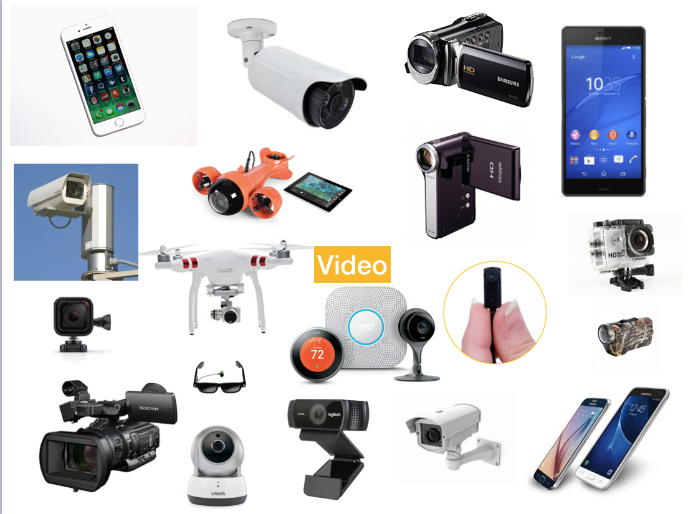

# 🎥📻VIDEO📺💾📹ART📼📷(pre)HISTORY💻
#### .・゜:✧･ﾟ: *✧･ﾟ:* SJSU Art 75 | Fall 2017 *:･ﾟ✧*:･ﾟ✧
 

## ▼△▼△▼△▼ Film v. Video: some notable differences
 

FILM | VIDEO     
 :------------- | :-------------
Experimental/Avant Garde film stems from cinema, photography, and cell animation.| Video Art emerges from technologies of broadcast radio and television.
Theorists such as Roland Barthes argue that a photo is always coded as past. Film evokes history/memory. | Video evokes transmission. It is the same image broadcast simultaneously on many TVs. Video is immediate, continuous, and coded as live.
Film is a sequence of frames, each a discreet unit     | The video image is composed of scan lines in constant progression     
Film needs to be processed | Video can be immediately played back
You can see the image on a frame of film | Video's encoded information is not recognizable
 
 

Now, video capturing devices are omnipresent, in this country and many others. Beyond a single television, video is now coming through our phones, computers, and often surrounds us in urban environments on billboards and in storefronts. Most of us watch a video every day. And perhaps are recorded regularly as well. With omnipresent video, the nature of video art continues to change, and our experience of videos continues to change as well.

## ▼△▼△▼△▼ Video as an art medium

##### Reflexive, hybrid, interdisciplinary
Theoretical approaches to studying video locate it as a medium that is reflexive both onto itself and cultural/artistic histories and trends. It is a medium that is constantly in dialogue with contemporary culture and in relation to other art mediums — a hybrid inter-medium. interdisciplinary practices are common to artists working in video.

##### Relation to Technology
Video and New Media Art, more than any other medium, are marked by their relationship developing technology. Because the tools of production are constantly being overhauled for the next new technology, Video/New Media Art is often a reflection of and an inquiry into the nature of cultural/technological change.       
 
 

## ▼△▼△▼△▼ Pre-histories

#### History of Radio and Transmission

Sound is an often overlooked component of media art and history. Electromagnetic transmission was the first form of wireless communication, established in the 1800s. It began with the telegraph (1844), followed by the radio and telephone.

These were the first technologies of **telepresence**, the real-time convergence of time across physical distance, central to the study of cyberculture.

 

Radio, as televisions precursor, set standards for future of broadcasting.  It was the battleground for national and corporate control of mass media, establishing many aspects for later institutionalization of the media.

Many of the forms common to television were first established in radio programming: serial programs, day-time "soaps," and prime-time shows. Before television, people debated radio as both technology that could unity the masses, while also a tool for forced indoctrination and conformity.
 
 

##### Spotlight on John Cage

[Watch John Cage *Variations VII* (1966)](https://www.youtube.com/watch?v=JxeFhRZwU84)

John Cage's work and teachings helped define the american avante-garde. He incorporated non-musical instruments into his compositions (or no sound at all), and championed the importance of experimentation and discovery over intention and end-result. In [*Variations VII*](https://www.youtube.com/watch?v=JxeFhRZwU84) he sourced sound from telephones and audience 'brain waves'.

  
[Watch John Cage perform *Water Walk* on the 1960 TV show "I've Got A Secret"](https://www.youtube.com/watch?v=gXOIkT1-QWY)
 
 

#### Art historical precedents

Leading up to the 1960s, there was a growing trend for artists to break with conventional notions of genre. Jackson Pollack's drip paintings were performative in nature. Allan Kaprow's "Happenings" blurred the lines between audience and stage and challenged the conception that art be physical or lasting in form.

Of notable influence was the Fluxus movement, a loose grouping of artists who critiqued traditional art practices and sought to blur the lines between art and life.

  *Fluxus Manifesto* George Maciunas.

 

> "Purge the world of bourgeoisie sickness, "intellectual," professional and commercialized culture, purge the world of dead art, imitation, artificial art, abstract art, illusionistic art, mathematical art, - PURGE THE WORLD OF "EUROPANISM!" PROMOTE A REVOLUTIONARY FLOOD AND TIDE IN ART, promote living art, anti-art, promote NON ART REALITY to be fully grasped by all peoples, not only critics, dilettantes and professionals."   - George Maciunas *Fluxus Manifesto*

 
 

   
[Sun in Your Head - Television Decollage](https://www.youtube.com/watch?v=JiBTMXHu_0E) (1963) is a film by Wolf Vostell, a German artist at the center of European Fluxus and Happenings movements. Because no video playback was available at the time, he recorded images from a television set onto film. *Sun in Your Head* is one of the first investigations of TV as a medium onto itself.
 
 

   *Vagina Paintings* Shigeko Kubota (1965)

In *Vagina Paintings*, Fluxus artist Shigeko Kubota ties a paint brush to her skirt in a reference to Jackson Pollack's drip paintings, combating the image of the male auteur in the patriarchal art world.

 
 
