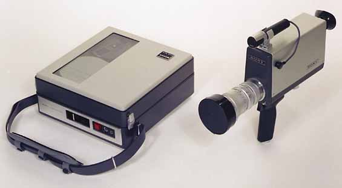
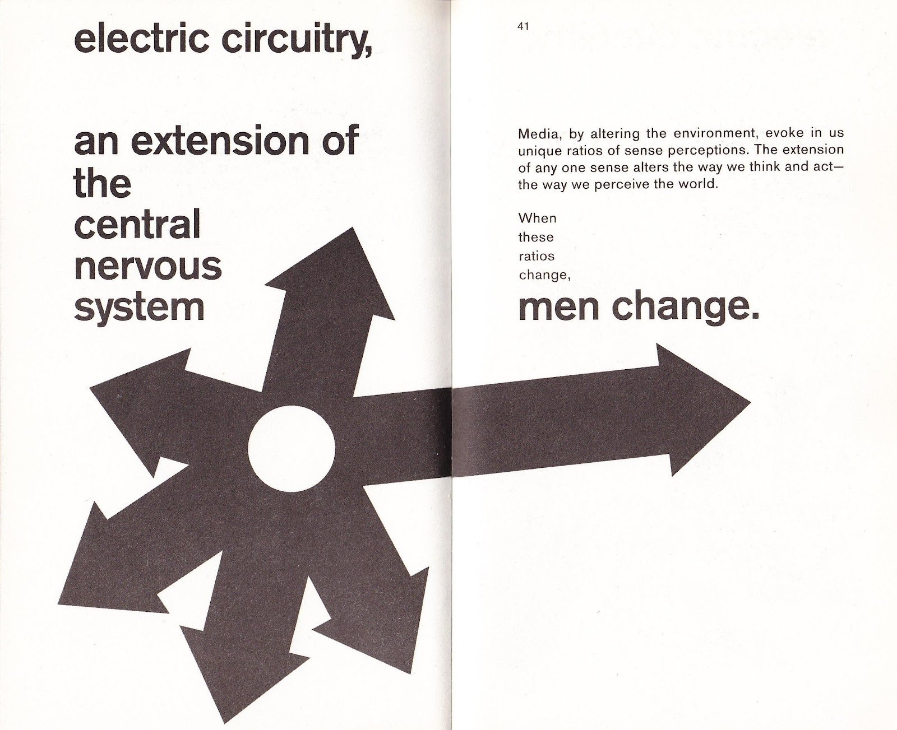
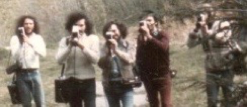
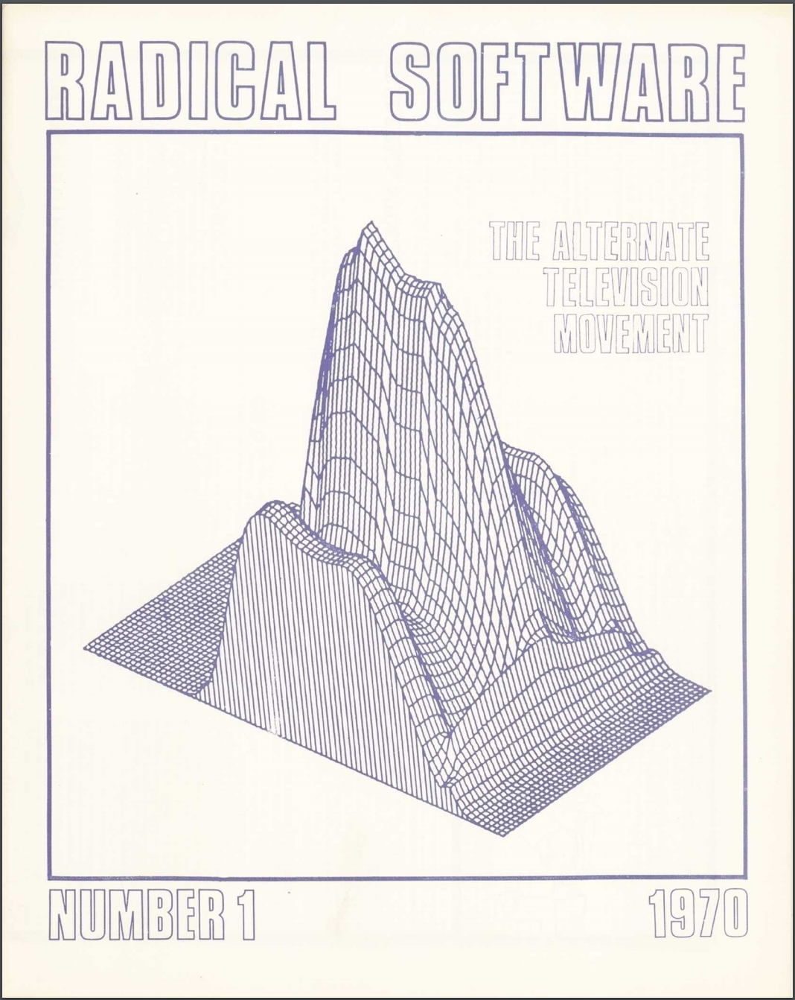
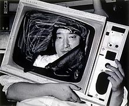
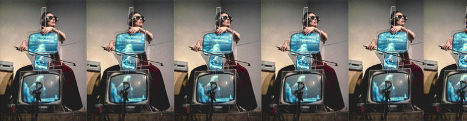
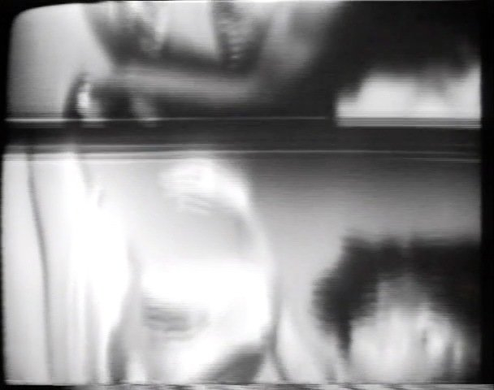

# 🎥📻VIDEO📺💾📹ART📼📷HISTORY💻
#### .・゜:✧･ﾟ: *✧･ﾟ:* SJSU Art 75 | Fall 2017 *:･ﾟ✧*:･ﾟ✧
 

## PART 1: Inception and Trends

### Readings

* [Kate Horsfield: *Busting The Tube: A Brief History of Video Art*](../../readings/*horsfield_busting-the-tube_brief-history-of-video-art.pdf) (required)
* [Martha Rosler: *Video: Shedding the Utopian Moment*](../../readings/rosler_sheddingUtopianMoment.pdf)
* [Marita Sturken: *Paradox in the Evolution of an Art Form: Great Expectations and the Making of a History*](../../readings/sturken_paradox.pdf)
* [Sylvia Martin: *Video Art*](../../readings/martin_video-art-history.pdf)

 
 

## ▼△▼△▼△▼ Video's Inception: 1960's anti-establishment politics, idealism, and the Sony Portapak
 

#### ***1950s***
 
The 1950s were a time of consumerism and conformity. At the hearth of every nuclear family: the boobtube.
 

 
 
 

---
#### ***1960s***
 
The 1960s were a time of radical social change driven by the civil rights movement, ideological expansion, and an anti-establishment youth movement.
 

 

It was at this moment that consumer video cameras hit the market. Media activists saw video as a democratizing form of media production that would challenge the television monopolies, revolutionizing the relationship between producer and consumer.
 
 
 

---
#### ***The Sony Portapak 1965***

The Sony Portapak was the first video camera available to the consumer. Prior to the Portapak all means of production and broadcast were controlled by government and corporate media.
 

Actually intended for small business and industrial uses, the Portapak was clunky—with an  external recording deck separate from the camera—and sometimes took two people to operate.  
 

 
*Sony Portapak*
 

Media activists, empowered by access to media production, revolted against the 1950s TV empire of their youth by producing their own images distinct from corporate control. Many saw video as a democratizing form that would challenge the television monopolies, something that would enable them to revolutionize the relationship between producer and consumer.
 

> Video reversed the process of television, giving people access to the tools of production and distribution, giving them control over their own images and, by implication their own lives      - Radical Software 1:1

> "TV has been attacking us all our lives, now we can attack it back."
 - Nam June Paik

 
 

---
#### ***Marshall McLuhan***
 

   
A prominent media theorist of the time, McLuhan's ideas were hugely influential to early video artists and activists. His phrase "the medium is the message" states that the medium itself is embedded in whatever message it might convey.

> "The new electronic independence re-creates the world in the image of a global village."   - Marshall McLuhan

> McLuhan’s ideas placed technology at the center of human transformation and emphasized that the emerging technology not only would transform consciousness but also provide a very powerful path to social change.  
-Kate Horsfield: *Busting the Tube*

 

 
 
 
 

---
#### ***Technological Utopianism***

What are parallels between video's [technological utopianism](en.wikipedia.org/wiki/Technological_utopianism) and the [cyber-utopianism](en.wikipedia.org/wiki/Cyber-utopianism) of the early internet?

*Next weeks reading* — [Critical Art Ensemble *Utopian Promises, Net Realities*](../../readings/critical-art-ensemble_Utopian-Promises-Net-Realities.pdf)

 
 

## ▼△▼△▼△▼ Video Art History

##### Two principle groups staked claim in the medium:
1. media activists
2. artists creating performance-based conceptual works or formal inquiries into the nature of the medium

 
 

---
### ***----> 1: Media Activists***

Sometimes called "guerilla television", media activists saw themselves as players in a war-like operation against dominant media.

  *Videofreex Collective members*

Because professional editing systems were expensive, people were limited to editing by manually copying footage from one deck to another. Often videos were single shots. The collectives' grainy, unedited reporting stood in contrast to polished corporate media—this aesthetic of DIY citizen journalism was (and still is) coded as being more "authentic".

 
*Videofreex member taping a protest*
 
 

---
#### ***Collectives***

Collective life-styles were a hallmark of the times, and video collectives popped up in New York City and West Coast.

New York City | West Coast
 :------------- | :-------------
 [Videofreex](https://videofreex.com/)   Raindance   Global Village   People's Video Theater | Ant Farm   Video Free America   Optic Nerve   Top Value Television

You can view clips from Videofreex' guerilla reporting on [Video Data Bank's Videofreex Archive](http://www.vdb.org/collection/Videofreex%20Archive). Archiving the Arts also has a [fairly recent interview](http://www.imappreserve.org/archivingarts/videofreex/) with them.
 
 

Ant Farm took a different approach to many of their works, staging media spectacles that appropriated images of popular icons.
 

Watch [Ant Farm's *Media Burn*](https://vimeo.com/20812025).
 
 
---
#### ***Radical Software***

[Radical Software](http://www.radicalsoftware.org/e/index.html) was a journal alternative media makers published by members of the Raindance collective.

Radical Software spoke of technology as a cultural force, presenting a cybernetic (network/system-based) approach to understand it, and called this media "ecology." Early proponents of information freedom, they created a new copyright symbol: a crossed out circle meaning: "please copy."

  *Radical Software, issue #1*

 
 

---

#### ***Artists occupying the airwaves***

  

In [Facing a Family](https://www.youtube.com/watch?v=-mBxoDvB5xI) (1971), VALIE EXPORT, an Austrian feminist performance artist, filmed a family as they were eating dinner with the camera positioned from the TV's perspective. The work was broadcast on Austrian television — EXPORT wanted the audience to consider the passive role we take in TV spectatorship, and to reflect on the disjunction between TV fantasy and living-room reality.
 
 

 
*TV Interruptions: Tap piece*, David Hall (1971)

Also making use of the airways, Scottish artist David Hall produced a series of [*TV Interruptions*](https://www.youtube.com/watch?v=AA9IdHtHk_0) that were broadcast anonymously on Scottish Television in 1971.
 
 

  
Chris Burden's *TV Commercials* (1973-1977)

In the US, artist Chris Burden infiltrated the airways by purchasing commercial time on broadcast television and aired his own 'ads.'

[Watch documentation of Chris Burden's TV Commercials (1973-1977)](https://www.youtube.com/watch?v=XelIqsYFu3I)  

 
 

---
### ***----> 2: The Art World***

Many experimental artists were drawn to video less out of an interest in affecting social change, but more through Fluxus-inspired ambitions to subjugate the standard relationships between artist and viewer, and redefine/undermine the commercial conventions of the art world.

Artists also made formalist inquiries into the new medium, exploring its essential qualities as one would do in painting, photography, or sculpture.
 
 

   *Nam June Paik*

Nam Jun Paik is often heralded as the first video artist. Coming out of the Fluxus movement, he moved television beyond its normal associations and subverted it as object and subject in art performances and installations.

In *TV Cello* (1964) he creates a fully-functional cello out of three TV sets for avant-garde cellist Charlotte Moorman. One TV shows an image of Moorman performing live, another a montage of other cellists, and the third an intercepted TV broadcast.

[Watch Charlotte Moorman perform with Paik's 'TV cello'](https://www.youtube.com/watch?v=-9lnbIGHzUM)
 
 

---
### ***Video and Performance Art***

Video was commonly used in art as a tool for documenting performance.

Most was conceptual art that centered idea and process over form. Artists used the intimacy of video to explore body and self as site of relation to society.

 

Vito Acconci plays with the discomfort of social power relations in [*Pryings*](https://www.youtube.com/watch?v=Z0JbuHDMxVU), 1971.

William Wegman often took a lighter approach—his dogs were both subject and muse.

 
[Watch selections of William Wegman's video work.](https://www.youtube.com/watch?v=lrdnlPK9sUQ)
 

 Adrien Piper *Wet Paint*

Adrien Piper used her body to confront liminal space in gender and racial identity.

[Watch Adrien Piper *Mythic Being* 1971](https://www.youtube.com/watch?v=jVcXb8En_Tw)
 
 

[*Mass of Images*](https://vimeo.com/13859073) Ulysses Jenkins (1978)

Ulysses Jenkins is a video artist from Los Angeles whose work examines constructions of race and the power of the state. He formed the media group Video Venice News in 1972 and continued to work in video for the next 4 decades.

[Watch a 2011 interview with Ulysses Jenkins](https://vimeo.com/92313070)

More work by Jenkins:
* [*Without Your Interpretation*](https://vimeo.com/13690709) (1983) is an art/music video and documentation of performance art.  
* 1983 computer animation [*ZGrass*](https://vimeo.com/13690834) using Datamax software
* [*Planet X*](https://vimeo.com/13718164) (2006)

[*Radical Presence*](http://radicalpresenceny.org/) — amazing show and book on black performance art history that is [free online right now](https://issuu.com/thecamh/docs/2012_radical_presence)
 
 

 
*Stamping in the Studio* Brue Nauman (1968)

Bruce Nauman's early video works played with the mechanization and de-personalization of the human body. He made use of the immediacy and intimacy of portable video and recorded himself in his studio, often placing the camera at an odd angle to achieve a greater level of abstraction.    

[Excerpt of *Stamping in the Studio*](http://www.vdb.org/titles/stamping-studio) (1968)

[*Wall floor positions*](https://www.youtube.com/watch?v=IMSyhyvr0mw) (1968)
 

*SHOOT* Chris Burden (1971)

In *SHOOT* (1971) Chris Burden captured the human body in extreme states of fear and pain in a landmark piece of extreme performance art. His friend fired at him with a 22 calibre rifle, puncturing his upper arm.

 
 

---
#### ***Trends in formalism***

Artists who took a formalist approach to video employed the technology of video as content as well as the form for their work.

These were investigations into the intrinsic properties of the medium, ie. feedback, the intimacy of real-time recordings and the size of the images produced.

In *Vertical Roll*, video provided Joan Jonas a means to explore the disjunction between performance and a recording of that performance. Here, a performance of her alter-ego belly dancer Organic Honey is fragmented by a roll caused by varying framerates in video recording and playback.

  
[Watch Joan Jonas' *Vertical Roll* 1972](https://www.youtube.com/watch?v=jpstpzBDJ7s)
 

This formal inquiry expanded into installation space. Live feedback systems made viewers not only spectators but also subject of the art work, calling to light the nature of immediate playback and the disjunction between the video recording and physical space.

In *Live/Taped Video Corridor*, Nauman placed a TV at the end of narrow corridor. As viewers approached the televisions — one showing the empty room and another a live image of the viewer in the space — they see their own image recede as they get closer.
 

Bruce Nauman *Live/Taped Video Corridor* (1970)
 
 

---
#### ***Video Synthesizers***

More advanced post-production technologies (keying, colorizing) were developed in 1970s, but still were expensive and inaccessible to most consumers. Artists who wanted to work with special effects needed to engineer their own special effects synthesizers, creating early works in generative video, and computational media.

 
[Watch Ed Emshwiller's *Crossings and Meetings* (Excerpt) 1974](http://www.vdb.org/titles/crossings-and-meetings-excerpt)
 
 

[Watch Gary Hill's *Electronic Linguistic* 1971](https://vimeo.com/5499417)
 
 
  
 
[Watch Lillian Schwartz' *Pixellation* 1970](https://www.youtube.com/watch?v=Ewrron-bf5k)
 
 
 

---
#### ***Institutional Expansion in the 1970s***

- *More formal art funding from state*
- *Nonprofit media arts centers that offered low-cost access*
- *Acceptance of video into art academy — schools added video and performance art studies into curriculum*

Video had value in academia in that it lent itself to cross-disciplinary practices. It was a vehicle for creative explorations of theory as "video essays", tying in performance, identity, feminism, psychology, cultural studies, etc.

Here is a very famous example:

[Watch Martha Rosler's *Semiotics of the Kitchen* (1975)](https://vimeo.com/116580896)

Donna Haraway — author of *Cyborg Manifesto* and current scholar at UC Santa Cruz — used video as a vehicle to convey her associative historical/cultural theories on the conception of 'man'.  

[Watch *Donna Haraway reads 'The National Geographic' on Primates* (1987)](https://vimeo.com/218047623)
 
 

In contrast to it's success in the academy, video art was struggling to find a home in the 1970s gallery world. Unlike painting/sculpture/photography, it was hard to sell.

Gallery collections dissolved into nonprofit archives: [Video Data Bank](https://www.vdb.org/) & [Electronic Arts Intermix](https://www.eai.org/), whose invaluable archival work continue to be excellent resources to this day.

 
 
 

---

## Problematizing Video Art History
 

["Paradox in the Evolution of an Art Form: Great Expectations and the Making of a History" Marita Sturken](http://pzacad.pitzer.edu/~mma/teaching/MS71/reading/sturken-1.pdf)

>"Histories do not simply evolve, they are *constructed* through certain agendas... (most commonly written out of history are women and people of color.)" - Marita Sturken

>Video has, from the beginning, had a very self-conscious relationship to it's own history.  "Not only was video being 'invented,' it was being staked out and claimed." -Marita Sturken

 

Video, no doubt, was ridden by a Post-modern self-consciousness. From the beginning, video artists sought to define the medium and claim their title in its history.

Video art history was being written simultaneously as the work was produced. This certainly could have been a mechanism for institutional survival, and also a result of the rapidly deteriorating medium—tapes might melt away, but written interpretations will last. Regardless, there are a few myths that resulted....

#### ***Myths of Video Collectives***

* In contrast to the portrayal of the radical collective spirit, many of the collectives were hierarchical and male-dominated. Raindance in fact started as a profit-making think tank. Its name was a riff on corporate R&D Research & Development
* Collectives are iconicized as anti-establishment and in opposition to TV, but artists from beginning were trying to get on the airwaves. 1969 Videofreex & others made a a documentary for CBS about counterculture (never aired). Top Value Television people later hollywood producers

In her article, Marita Sturken unpacks the the inherent paradox: how can one critique the technology while using it?

 >It points to a tendency to believe that machines dictate aesthetic development and a deep-set cultural belief that people do not really control machines but are always on some level conrolled by them. -Sturken

 
 
 

---

## links
* [Video Data Bank](https://www.vdb.org/)
* [Electronic Arts Intermix](https://www.eai.org/)
* [Independent Media Arts Preservation: Archiving the Arts](http://www.imappreserve.org/archivingarts/)
* [Experimental Television Center](http://www.experimentaltvcenter.org/)
* [Smithsonian Show: Watch This! Revelations in Media Art](http://americanart.si.edu/exhibitions/online/watch_this/)
