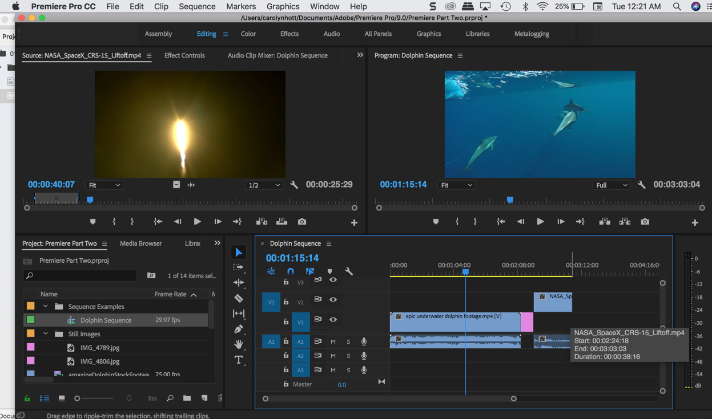

# Adobe Premiere... continued 🎥📹💻
-->[Go here for first Premiere tutorial- the basics](https://github.com/art75/SJSU-art75/tree/master/tutorials/01_Premiere)

 ◇─◇──◇────◇────◇────◇────◇────◇─◇─◇
 

##### Included on this page:

1. [Aspect Ratio and Sequence](#-aspect-ratio-and-sequence)
2. [Targeting Tracks](#-targeting-tracks)
3. [Adding Still Images](#-adding-still-images)
4. [Picture in Picture](#-picture-in-picture)
5. [Replace a Clip](#-replace-a-clip)
6. [Trimming a Clip](#-trimming-a-clip)
7. [Rate Stretch Tool](#-rate-stretch-tool)
8. [Audio Adjustments](#-audio-adjustments)
9. [Expanded Color Correction](#-expanded-color-correction)

# ▼△▼△▼ Aspect Ratio and Sequence

[Read and watch videos about resolution here](https://vimeo.com/blog/post/the-basics-of-image-resolution)

* When you drag a clip into the timeline, the new sequence in the timeline sets up settings to match that of the clip.
* If all of your clips are the same size and frame rate, then this is a good way to go.

* If your clips are different sizes and frame rates, and you have a specific outcome needed for your sequence, determine your aspect ratio and size by creating a sequence ahead of time.

* You can check your sequence settings by hovering over your sequence in the Project window (note: sequence icon vs stills vs audio/video)

* You can also right click and navigate to **'sequence settings'**

* Here you can make adjustments to the frame rate and aspect ratio if needed.

# ▼△▼△▼ Targeting Tracks

- You can target tracks by pre-selecting V1 (video) or A1 (audio) before moving your clip to the timeline.

Timeline Tips:

# ▼△▼△▼ Adding Still Images

* Create a new Bin in your Project window for your still images.

* Click open the bin and double click in the window to import your still images.
* Once imported, you can view your source images in the source monitor as you did with your video files.

* You can drag your still images from the source monitor to the timeline, as with your video files.
* To lengthen the amount of time that the still is in your video, drag one side or the other of the box on your timeline.

# ▼△▼△▼ Picture in Picture

* To overlay a clip or still image on a sequence, first select your media file in your Project Panel and mark in/out if needed in the Source Monitor.
* Then drag from the Source Monitor to the Program Monitor, and a grid of options will appear> Hover and let go on **Overlay**
* Once you let go, the clip should appear in the V2 row of your timeline.
* You can then move it to the exact location in the sequence you would like.

* To resize the clip that is overlaid, click on the clip in the Program Monitor and a wireframe and crosshairs will appear
* Drag the wireframe until the clip is the size you would like
* Move the image to the screen location you would like in your overall video

# ▼△▼△▼ Replace a Clip
++ in progress++

 dragging and holding option key

 if you want it to ripple = option delete
delete an area
-can use razor tool but in and outs is better ... use colon and apostrophe - this will only lift/extract the active tracks
 

# ▼△▼△▼ Trimming a Clip
++ in progress++

- ripple edit tool 'b' or command keyboard modifier
- e = shortcut for extended edit - instead of dragging clip to cursor.
 
- rolling edit tool and rate stretch tool are hidden under ripple edit
 
option and arrow will trim left or right once edge is selected
 
if you want to edit just audio or video in synced clips, hold down option to just affect that track

# ▼△▼△▼ Rate Stretch Tool

* To expand a clip on your timeline (beyond the out point you set in the Source Monitor) just drag the footage using your mouse on the timeline to change duration
* You can also right click on the clip and select **speed/duration** to make adjustments to the speed and duration.

# ▼△▼△▼ Audio Adjustments
-->[links to more tutorials here](https://github.com/art75/SJSU-art75/tree/master/tutorials/01_Premiere#-working-with-audio)

++ in progress++

- difference between gain and volume
- to change audio configurations for source audio, right click in project window and go to modify -> audio channels
- shortcut for raising lowering volume is brackets
- add keyframes in timeline, command or control click on volume level bar itself  
- bracket shortcut applies to keyframes
- delete keyframes by just hitting delete
- dissolves = shift cmmd D
- show default length for cross dissolves in project settings

# ▼△▼△▼ Expanded Color Correction

++ in progress++

workflow: correct individual shots and then shot to shot consistency

Basic tools

- lumetri scopes: parade and waveform

- auto color, auto contrast, auto levels are all obsolete effects that can help

lumetri color correction 
- hit auto at bottom

first do tone = exposure contrast
tone:
- highlights/shadows affect just them and not others
- whites/blacks = white/black point = adjust upper and lower limits
    - common to raise white point and lower black point to make it more contrasty

white balance
- use dropper on a white point
