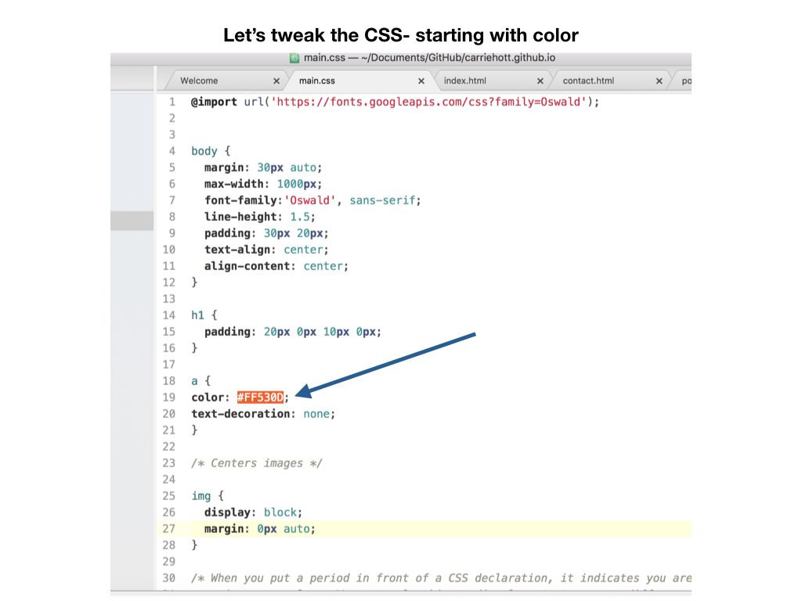
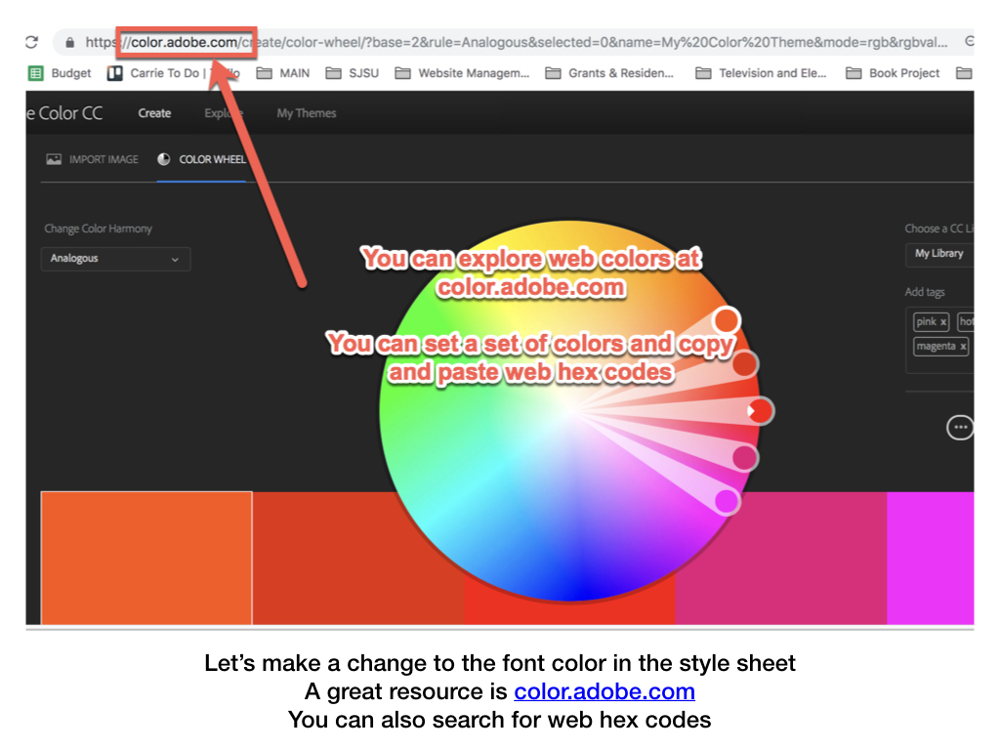
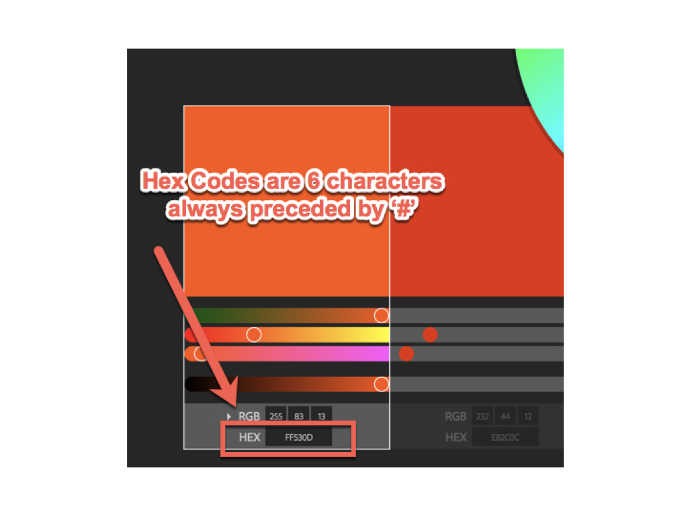
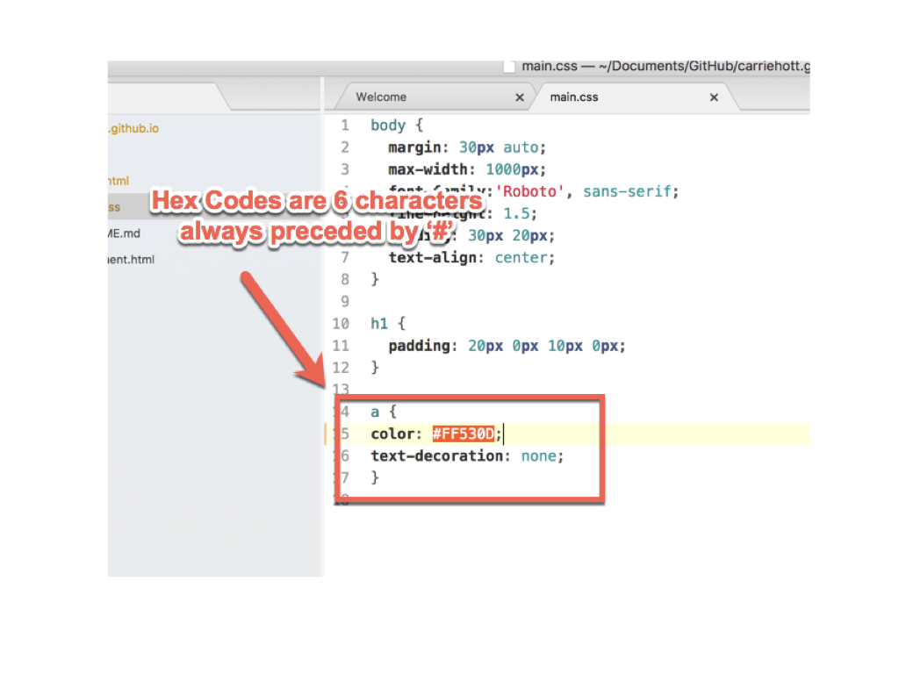
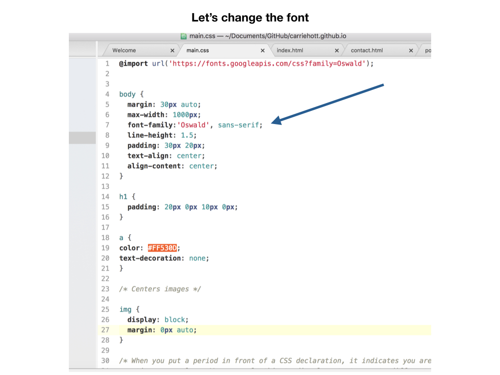
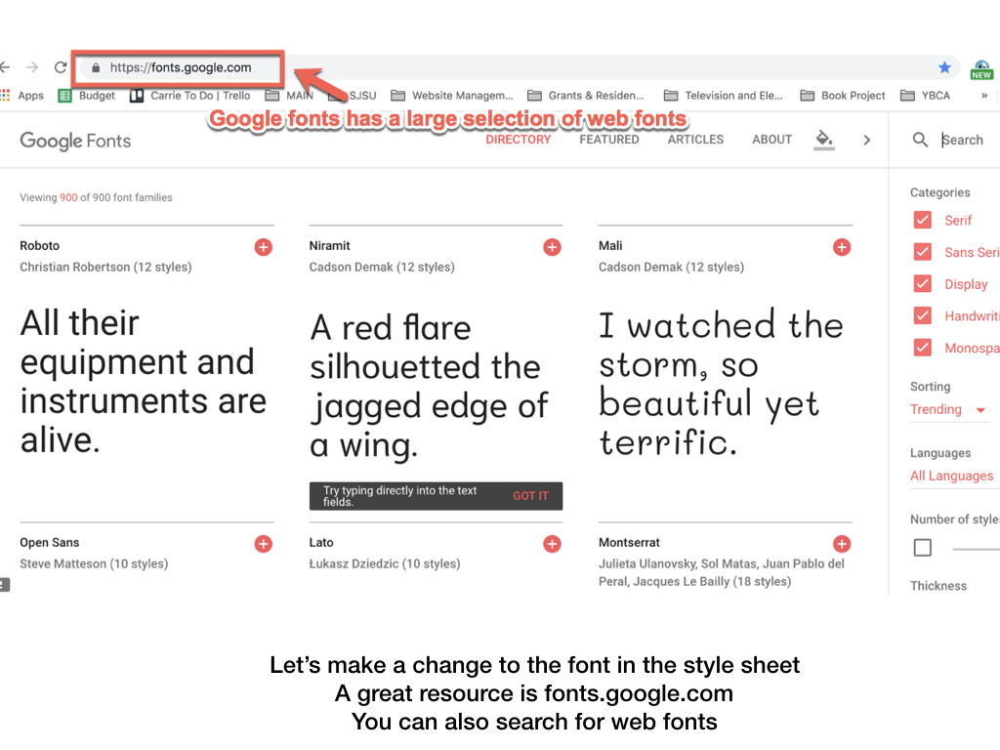
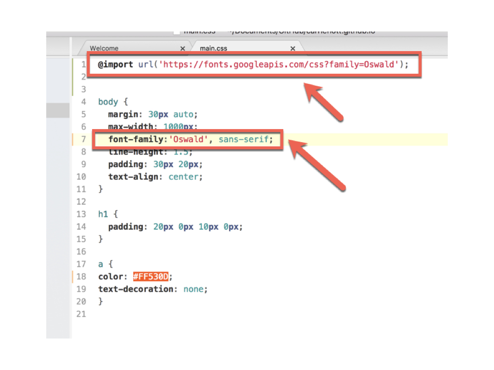

# More HTML/CSS 👏👾🤓
## Favicons, Custom Domains, libraries, and Search Engine Optimization (SEO)

 ◇─◇──◇────◇────◇────◇────◇────◇─◇─◇
 

#### On this page:

1. [Adding favicons](#-favicons)
2. [Custom Domains](#-custom-domains)
3. [Using frameworks and templates for your CSS styling](#-using-frameworks-and-templates-for-your-css-styling)
4. [Search Engine Optimization (SEO)](#-search-engine-optimization)
5. [Adjusting Color and Hex Codes](#adjusting-color-and-hex-codes)
6. [Adjusting Fonts](#adjusting-fonts)
7. [Change Link Hover Color](#change-link-hover-color)

---
 

# ▼△▼△▼ Favicons

Favicons are the little symbol in the browser tab of your webpage. To make a custom favicon for your site:

1. Create a SQUARE image in photoshop/illustrator, I make them 500 x 500px so there's plenty of room to downsize. Export them as PNGs if you want transparency (recommended). Keep the image super simple because they will be so small!

2. Upload image to an online [favicon generator](https://realfavicongenerator.net/)

3. The favicon generator will create a bundle of favicon image files in different sizes/formats so your favicon will show in different browsers/devices. Download the zip and place files in the root directory of your website. The root directory is the main folder, where your homepage index.html lives.

4. The generator will also give you HTML — this goes in the <head> of your HTML (not the body).

That's it!

 
 

# ▼△▼△▼ Custom domains

You can purchase a custom domain from a domain name registrar. GoDaddy and NameCheap are two popular sites.

Once you have purchased your custom domain, connect the domain to your GitHub page. This way, whenever someone goes to www.yourName.com, your GitHub page will load.

* [General tutorial from GitHub help](https://help.github.com/articles/quick-start-setting-up-a-custom-domain/)
* [Tutorial specific to GoDaddy domains](https://medium.com/@LovettLovett/github-pages-godaddy-f0318c2f25a)
* [Tutorial specific to NameCheap domains](http://davidensinger.com/2013/03/setting-the-dns-for-github-pages-on-namecheap/)

 
 

# ▼△▼△▼ Using frameworks and templates for your CSS styling

You would have to learn a lot about modern CSS to get your website looking clean and mobile-responsive (so that it resizes for readability on mobile phone).

If you want to go this route, be sure to use media queries and (I would recommend) flexbox.

Adapting templates or using a library/framework like Twitter Bootstrap are great options.

### Adapting CSS templates

Templates are great! There are many resources online ---> [templated.co](https://templated.co/) has a LOT of free templates to use.

You can find a lot of sample code on [W3 schools](https://www.w3schools.com/css/default.asp).

*Warning*: Sometimes customizing templates can get sloppy if you have conflicting CSS rules.

### Twitter Bootstrap

Twitter Bootstrap is a framework that makes it EASY to create responsive websites that are designed for mobile-first.

In its simplest form, it is basically a CSS library that you can link to just like your custom css style sheet. To use bootstrap, add this line to your HTML head:

      <link rel="stylesheet" href="https://stackpath.bootstrapcdn.com/bootstrap/4.1.3/css/bootstrap.min.css" integrity="sha384-MCw98/SFnGE8fJT3GXwEOngsV7Zt27NXFoaoApmYm81iuXoPkFOJwJ8ERdknLPMO" crossorigin="anonymous">

Because of the was CSS cascades, you will want to link to bootstrap BEFORE you link to your  style sheet in the code, so be sure to have the bootstrap link on a line above the link to your css file.

Then grids are easy! You can just plug in Bootstrap class names to build out your site structure. Here is code for a 2 row grid. The top row has 3 columns and the bottom row has five.

    

        

          

          

          

        

        

          

          

          

          

          

        

    

To make them responsive, you can get way more detailed. To learn more, check out the [Bootstrap documentation guides](https://getbootstrap.com/docs/4.1/layout/grid/) or check out the tutorials below.

Tutorials:
* [Lynda Bootstrap 4 Essential Training](https://www.lynda.com/Bootstrap-tutorials/Bootstrap-4-Essential-Training/372545-2.html). You can learn a lot in just the first 2 chapters (~1hr of tutorials)
* Or go through the [W3 schools tutorials](https://www.w3schools.com/bootstrap4/default.asp)

 
 

# ▼△▼△▼ Search Engine Optimization

Okay, so you have a website, but how do people find it?

Search engines like Google scan the internet with bots to index all the websites and determine which ones show up in your search results.

So you want to make sure you give them the right descriptions and keywords!

In addition to the <title> tag, which shows up in the browser tab, you can also add a description and keywords. Insert this code into your HTML header, and read over this [PDF on how to optimize your HTML tags for bots](http://www.theinternetofbots.com/pdf/Search%20Engine%20Optimization%20-%20The%20Internet%20of%20Bots.pdf).

    <meta name="description" content="description in 50–300 characters (letters).">
    <meta name="keywords" content="artist, your name, your nick name, digital media art, all the keywords">

 

# Adjusting Color and Hex Codes

### **Open your main.css page if it is not yet. We are going to make _minor_ adjustments. Reminder: Be Careful and move slowly in CSS!**

 

# Adjusting Fonts

 

# Change Link Hover Color
You can add more style to your links and change the color on hover (when they are moused over), by adding more link 'a' selectors to your stylesheet.  For more link styling options- [check out this page.](https://www.w3schools.com/css/css_link.asp)

#### **Code to copy to your CSS document below your first 'a' selector:**

        /* mouse over link */
          a:hover {
              color: hotpink;
            }

### Your stylesheet should look like this:

